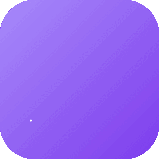
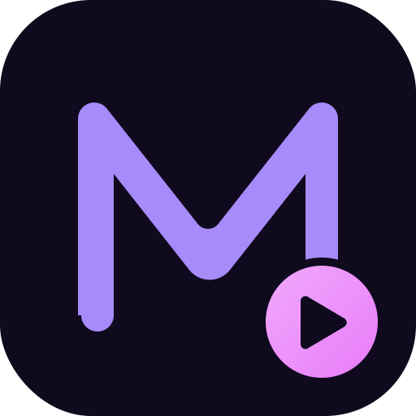
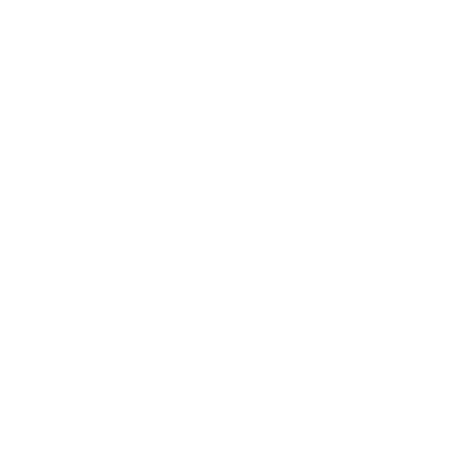
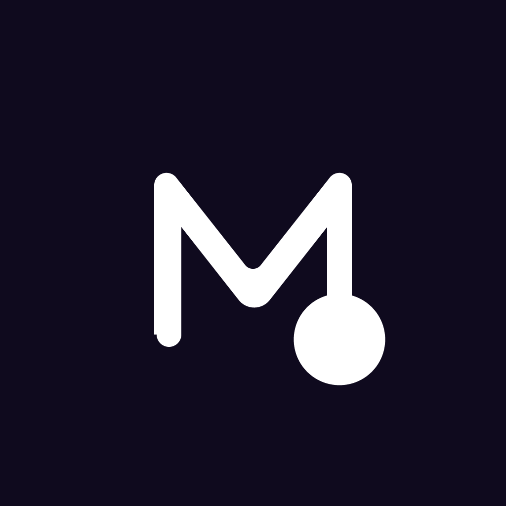

# MacroMate

<p align="center">
  
</p>

## Overview

**MacroMate** is a Chrome extension for **macro automation** — record, replay, and schedule browser actions with a friendly, playful feel. The mark is a bold rounded "M" lettermark with a pink **play badge** nested at the bottom-right corner — an automation cue that reads instantly as "ready to run."

- **Voice / Tone**: Playful & friendly
- **Format**: Squircle app-icon (Chrome extension toolbar style)
- **Primary color**: Vivid violet `#7C3AED`
- **Animation**: M traces in → play badge pops → soft pulse ring loops

## Logo Variants

| Primary | Dark | White |
|---|---|---|
|  |  |  |
| `icons-svg/Logo.svg` | `icons-svg/Logo-Dark.svg` | `icons-svg/Logo-White.svg` |

### Animated

| Animated SVG (SMIL, loops) | Animated GIF preview |
|---|---|
|  |  |
| `icons-svg/Logo-Animated.svg` | `icons-image/Logo-Animated.gif` |

## Image Samples

| File | Size | Preview |
|---|---|---|
| `Logo-52.png` | 52×52 |  |
| `Logo-128.png` | 128×128 |  |
| `Logo-256.png` | 256×256 |  |
| `Logo-512.png` | 512×512 |  |
| `Logo-Mockup-Light-1024.png` | 1024×1024 |  |
| `Logo-Mockup-Dark-1024.png` | 1024×1024 |  |

## Color Palette

| Token | HEX | HSL |
|---|---|---|
| Primary | `#7C3AED` | `262 83% 58%` |
| PrimaryGlow | `#A78BFA` | `258 90% 76%` |
| Secondary | `#4C1D95` | `264 67% 35%` |
| Accent | `#F0ABFC` | `293 96% 83%` |
| Background | `#FFFFFF` | `0 0% 100%` |
| Foreground | `#0F0A1E` | `258 50% 8%` |
| Muted | `#F4F1FB` | `258 60% 97%` |
| Border | `#E5DEF7` | `258 64% 92%` |

Full reference: [`colors-themes/Palette.md`](./colors-themes/Palette.md)

## Theme Tokens

Machine-readable tokens (flat PascalCase): [`colors-themes/Tokens.json`](./colors-themes/Tokens.json)

## Favicon

<p>
  
</p>

- [`favicon.ico`](./favicon.ico) — multi-size (16/32/48/64)
- [`favicon.png`](./favicon.png) — 256×256

> Per-project only. The repo-root favicon and `index.html` are intentionally not modified by logo creation.

## Usage

**HTML**
```html
<link rel="icon" type="image/x-icon" href="/Projects/01-MacroMate/favicon.ico" />

```

**CSS**
```css
:root {
  --mm-primary: #7C3AED;
  --mm-primary-glow: #A78BFA;
  --mm-accent: #F0ABFC;
}
```

**Tailwind (extend in `tailwind.config.ts`)**
```ts
theme: {
  extend: {
    colors: {
      macromate: {
        DEFAULT: "#7C3AED",
        glow: "#A78BFA",
        accent: "#F0ABFC",
      },
    },
  },
},
```

**Chrome Extension `manifest.json`**
```json
{
  "manifest_version": 3,
  "name": "MacroMate",
  "action": { "default_icon": { "128": "Logo-128.png" } },
  "icons": { "128": "Logo-128.png" }
}
```